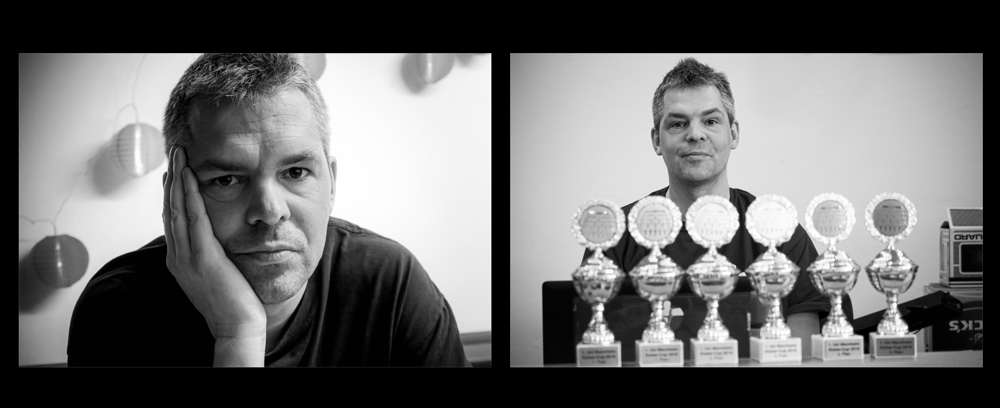
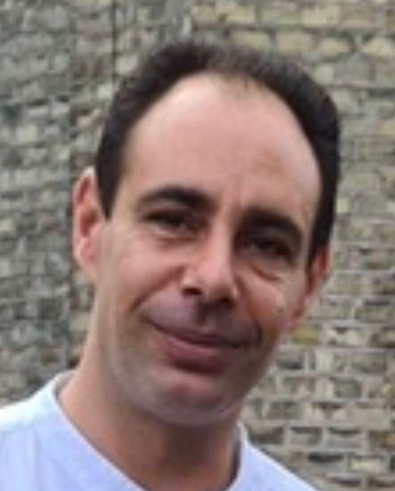

# Unvergessen – Torsten und Semy

## Nachruf auf Torsten Walker
Unser Vereinsgründer Torsten Walker ist am 30. Juni 2020 nach langer Krankheit verstorben. Torsten war ein ganz besonderer Mensch, der mit viel Leidenschaft und Engagement die Mannheimer Tischfußballszene geprägt hat. Im Namen des Vereins hat unser ehemaliges Vorstandsmitglied Dominik Schreiber einen persönlichen Nachruf verfasst.

Halbe Sachen waren mit Torsten nicht zu machen. Mal kurz irgendwo reinschnuppern oder irgendetwas nur halbherzig verfolgen, das war nicht sein Ding. Wenn Torsten sich einem Thema widmete, dann tat er das voll und ganz, mit 150 Prozent. Dann tauchte er tief in die Materie ein, immer mit Begeisterung, unglaublicher Neugierde und analytischer Kraft – mit Ausdauer, Leidenschaft und literweise Herzblut.

Das galt nicht nur für die Musik, Torstens großes Lebensthema, oder die asiatische Filmkunst, sondern auch für ein Hobby, bei dem es eigentlich nur darum geht, einen kleinen Plastikball in ein Loch zu schießen: Kickern, oder Tischfußball, wie der Profi sagt. Dass sich dahinter jedoch eine ganze Wissenschaft verbirgt, mit unterschiedlichen Komponenten wie Technik, Strategie, Psychologie, Teamgeist und Wettkampf, das faszinierte Torsten. Schon seit seinen frühen Szene-Jahren fand man ihn immer auch am Kickertisch: im JUZ, Old Vienna, CONTRA’N, Blau, dem Grünen Baum in Schwetzingen, dem Teufel und vor allem im Woodstöckl in der Neckarstadt-West.

Dort erfuhr die Mannheimer Tischfußballszene dann einen entscheidenden Aufschwung, bei dem Torsten natürlich – wie sollte es auch anders sein – die Hauptrolle spielte. Zunächst rief er im Sommer 2008 gemeinsam mit Markus Winterhalder eine erfolgreiche Turnierserie ins Leben – das Sonntags-DYP – und war dann 2010 die treibende Kraft hinter der Gründung von „Tischfußball Mannheim e.V.“ Ganz klar: Ohne Torstens unermüdliches Wirken würde es den Verein nicht geben.

Ich erinnere mich noch sehr gut an unser allererstes Treffen: im April 2007 am Kickertisch, bei meinem ersten Besuch im Woodstöckl, als ich gerade ganz frisch nach Mannheim gezogen war. Wir spielten gegeneinander, und ich werde nie vergessen, mit welcher Neugierde und offener Zugewandtheit Torsten mir damals begegnete. Auf seine unnachahmlich herzliche Art kommentierte er jeden Spielzug von mir. Torsten freute sich riesig, in mir einen geistesverwandten Kickerverrückten gefunden zu haben, und mir ging es mit ihm genauso. Es war der Beginn unserer Freundschaft.

Gemeinsam mit mir und anderen Gleichgesinnten machte Torsten über viele Jahre die Turniere in nah und fern unsicher: Von Freiburg bis hoch nach Bonn und ins Sauerland, von Saarbrücken bis Stuttgart. Mit René, Markus, Daniele, Felix, Michel, Christian, Claus, Josef, Volker, Jörg und vielen anderen erlebte Torsten eine intensive Zeit am Kickertisch, die Material für zahlreiche Anekdoten lieferte.

So musste ich einmal bei einer Hotelübernachtung mitsamt Matratze in den Vorraum des Zimmers flüchten, weil Torsten sagenhaft laut schnarchte. Oder wir saßen bis spät in die Nacht bei ihm in der Werbeagentur, weil er unbedingt eigentlich unwichtigen Fotos noch den nötigen Feinschliff verpassen musste. Da wanderten Turnierplakate in den Papierkorb und wurden neu gedruckt, weil der Farbton nicht ganz stimmig war.

Manchmal hätte man sich für ihn vielleicht gewünscht, auch mal fünfe gerade sein lassen zu können. Aber so war Torsten eben: durch und durch ein Perfektionist mit der Liebe fürs kleinste Detail. Er war ein großer Analytiker, ein Kopfmensch, jedoch mit ebenso großem Herzen und Gefühl: Wenn Torsten sich freute, dann ging das fast wie bei einem Kind durch seinen ganzen Körper, vibrierend von Kopf bis Fuß.

Der größte sportliche Erfolg kam gegen Ende seiner Kicker-Karriere: Mit dem Team schafften wir 2015 endlich den Aufstieg in die 2. Bundesliga und den sensationellen Durchmarsch in die 1. Bundesliga. Es waren Torsten und ich, die in den entscheidenden Spielen die Nerven behielten und den sprichwörtlichen Sack zumachten. Torsten war ein Kämpfer, der nie aufgab und uns andere immer wieder motivierte und mitzog.

Mit der Krankheitsdiagnose trat dann ab 2016 der Kickersport in den Hintergrund und die Musik wurde für Torsten wieder zentral. Mich selbst verschlug es 2017 nach Dortmund, doch wir hielten weiterhin Kontakt und wir trafen uns immer, wenn ich in Mannheim war. Seinen letzten Kampf konnte ich nur aus der Ferne begleiten. Dem engen Freundeskreis, der ihn hier so tatkräftig und liebevoll unterstützt hat, bin ich unermesslich dankbar.

Torsten wurde viel zu früh von uns genommen. Sein Tod schmerzt unendlich. Was bleibt, sind die vielen schönen Erinnerungen an den wunderbaren Menschen, der er war. *Eines ist sicher: Mit seinem Wirken und seinem Wesen bleibt Torsten unvergessen.*

## Nachruf auf Semy Kunkel
Am 12. April 2023 ist Semy Kunkel, Mitglied von Tischfußball Mannheim und Teil der letztjährigen Ligamannschaft nach schwerer Krankheit im Alter von 49 Jahren verstorben. Er hinterlässt zwei kleine Kinder. Wir trauern um ihn und werden ihn nicht vergessen!

