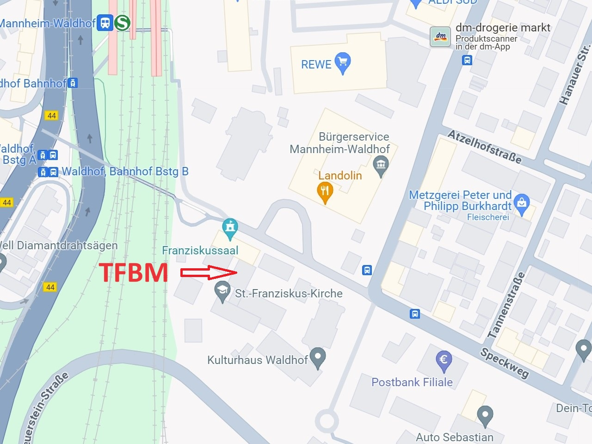

## Tischfußball Mannheim ist umgezogen
Am 01. Mai 2024 ist Tischfußball Mannheim in den Speckweg 6 in 68305 Mannheim umgezogen. Unsere neue Trainingsstätte befindet sich nun zentral im Stadtteil Waldhof direkt am Bahnhof Waldhof. Parkplätze sind 
beim Haus und in der Nähe vorhanden.

Anfahrtsskizze:

## Neu: Training nun Dienstags
Ab 01. Mai 2024 findet das **Vereinstraining** von Tischfußball Mannheim Dienstags ab 19.00 Uhr im neuen Trainingsraum statt. Wer Interesse am Verein hat, kann gerne schnuppern kommen.

## Freitags ist offenes Training
Freitags ab 20.00 Uhr findet das **offene Training** von Tischfußball Mannheim statt. Gäste sind jederzeit herzlich willkommen!

## DYPs und Turniere
2024 veranstaltet Tischfußball Mannheim wieder **DYPs** und - neu - Turniere, zu denen man als festes Doppel antritt. Weitere Infos und Termine folgen.

## Übersicht
Unsere regelmäßigen Spielzeiten im Speckweg 6:

|TAG|ZEIT| PROGRAMM |
|---|---|----------|
|Montag|—| —        |
|Dienstag|19 - 24 Uhr| Training |
|Mittwoch|—| —        |
|Donnerstag|—| —        |
|Freitag|20 - 01 Uhr| Offenes Training oder Turnier |
|Samstag|—| —        |
|Sonntag|18 Uhr| 1x im Monat: Turnier |

## Unsere Tische 
Wir verfügen derzeit über **zwei Ullrich P4P**, einen **leo\_pro professional** und einen **Bonzini**.

letzte Aktualisierung: Mai 2024
